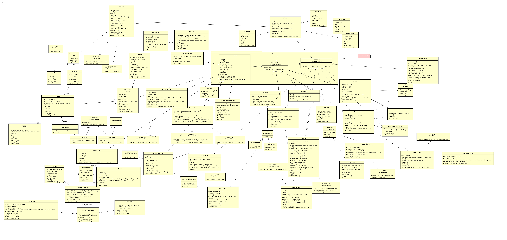

# CMPE 202 - Project - Team Hackathon

- Create a **Domain Model Diagram**

- - This should be a **UML Class Diagram** that organizes packages/classes that can be developed in parallel by each team member.
  - Typically, there may be one package for “Common” components, class definitions and/or interface definitions.  The common classes can be worked on by all team members at different times/days in the Sprint.

## Overall Class Diagram

