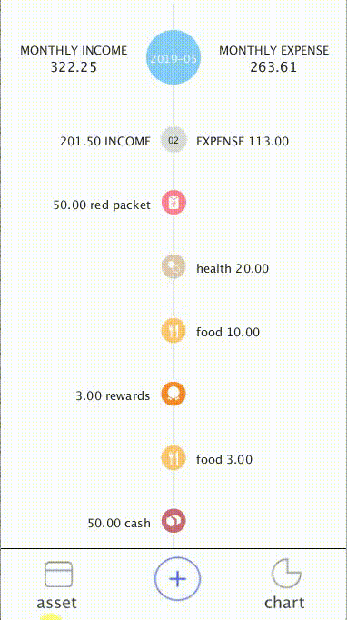
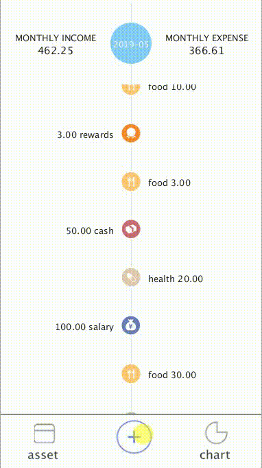
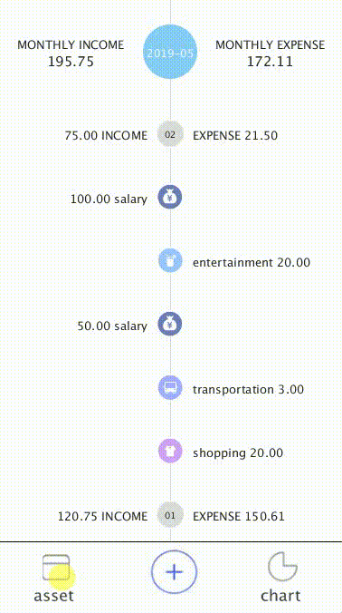
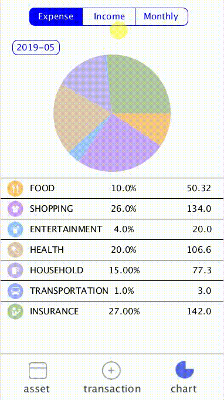

# Team Project Repo
https://github.com/nguyensjsu/sp19-202-rocket-202
## Team Name
Rocket202
## Team Members & Journals
* Han Wang [Journal](<https://github.com/nguyensjsu/sp19-202-rocket-202/blob/master/journal/Han%20Wang.md>)
* Xingchen Kang [Journal](<https://github.com/nguyensjsu/sp19-202-rocket-202/blob/master/journal/Xingchen%20Kang.md>)
* Min Yu [Journal](<https://github.com/nguyensjsu/sp19-202-rocket-202/blob/master/journal/Min%20Yu.md>)
* Yijun Zhang [Journal](<https://github.com/nguyensjsu/sp19-202-rocket-202/blob/master/journal/Yijun%20Zhang.md>)
* Shiyan Cai [Journal](<https://github.com/nguyensjsu/sp19-202-rocket-202/blob/master/journal/Shiyan%20Cai.md>)

## Project Name
#### Poke Accounting


## Project Description
Poke Accounting is an accounting software, allowing users to add and check personal expense and income records.
Poke Accounting also provides different charts to help you visualize your record.
Account function make it easier to follow your account balance.
Poke Accounting has its own login authentication to guarantee your personal privacy.

## Presentation

[Rocket 202 Presentation](https://github.com/nguyensjsu/sp19-202-rocket-202/blob/master/docs/Rocket202-Pre.pdf) 

[Rocket 202 Presentation AD Video](https://www.youtube.com/watch?v=YM0X7sqA9sc&feature=youtu.be)

## Project Progress

### Burndown Map

https://docs.google.com/spreadsheets/d/1RVyDYU9kWllowJlikY2BKtmSpdxpajvTHTAQleGj4No/edit?usp=sharing

### Project Dashboard

### Individual Contributions

**Login screen: Shiyan Cai**


**Record Flow screen: Yijun Zhang**



**Add Record screen: Xingchen Kang**



**Asset screen: Han Wang**



**Chart screen: Min Yu**



#### Han Wang

1. Provide application prototype, app name and logo
2. Use ```Observer``` Design Pattern when implementing Keypad function which is used in two screens: Input account balance screen and add account record screen
3. Use ```Composite``` Design Pattern when implementing input new account balance screen. Components are Keypad and OutputText
4. Use ```Observer``` Design Pattern when implementing add new account function.
5. Create a tool CSVHelper which help to read and write csv files. And it’s used in three parts: read each account balance from accounts.csv, write new account information into accounts.csv, write new record into records.csv
6. Develop a comprehensive UseCase diagram
7. Develop add account use case specification with supporting Sequence diagram
8. Develop an Ad Video for the application
9. Complete app testing, find out problems and fix bugs in the code
10. As a role of XP value “Courage”, when some thing was wrong, I pointed it out and provided my solutions. I encouraged our members to try new things. And I also encouraged them that we don’t need to be afraid with failures because we are a team.

#### Min Yu

1. Develop Tools class for time conversion: convert unix timestamp to datetime and convert datetime to unix timestamp.
2. Get data and analysis data from record.csv, generate corresponding statistics CSV data in order to easy display data on Chart screen.
3. Develop pie chart code in order to show it on Chart screen.
4. Create tab icon for Chart screen.
5. Use ```Strategy``` design pattern to get record.csv data into relevant statistic csv file.
6. Use ```Template``` design pattern to generate Expense/Income/Monthly screen on Chart screen.
7. Complete overall class diagram.
8. Create gif for each person demo.
9. As a role of XP value "Feedback", I always test the program. If I find bug, I told it to my team mates and communicated with them.


### Xingchen Kang
1. Create UI Wirefames.
2. Develop a MenuScreen that add a menu bar to normal screen using ```Decorator``` Design Pattern.
3. Develop main screen control flow for the app using ```Command``` Design Pattern.
4. Develop a add record screen using ```Composite```, ```Strategy``` and ```Observer``` Design Pattern.
5. Develop a choose account screen for adding record.
6. Develop change screen and add expense record use case with supporting sequence diagrams.
7. Develop an AD video for the APP.
8. As a role of XP value "Simplicity", I always remind my team to keep things simple, cut off unnecessary developing demands and add small development pieces into the whole framework.

### Shiyan Cai

1. Build major stracture of application, implemant a ```proxy``` pattern for login authentication.
2. Create login screen for authentication.
3. Create reset password process, allow user to enter old passcode, enter new passcode, and verify new passcode. Implemented with ```state``` pattern
3. Design a keypad for login process. Include shaking effect when enter wrong passcode, and button may change color when pressed.
4. Design drag effect for the drag effect for the chart screen. Allow to drag up and down, and list may slowly come back when bottom display area leaves empty.
5. Design a line chart to show income, expense, and balance change in current year.
6. Apply a gradient color change on the line chart.
7. Add a welcome screen, when open the application.
8. Create the sequence diagram for both login and reset passcode process(sucessfully reset).
9. Create state machine diagram for reset pascode process.
10. As a role of XP value "Communication", I gurantee our group meet at least one time a week, and all members keep contacting with each other through wechat. I also make meeting record to allow others to review the decision made through the meeting.

### Yijun Zhang

1. Design and develop the Main Screen of Flows, which generally reads data from data records.csv, and displays them in hierarchical time order with daily and monthly total values.
2. Use ```Decorator``` Pattern to add name to related flow icon of each income and expense record.
3. Use ```Strategy```Pattern to show monthly and daily flow headers which have same contents combination but different sizes and locations for displaying.
4. Use ```Builder```Pattern to build the month flows with all recorded day flows in this month(which contains several detailed daily flow records）with hierarchical hearders showing hierarchical total values.
5. Use ```Observer```Pattern to ensure the month total value will change once the displayed flow changes.
6. Develop the drag function for Flow Screen with special sign displayed in the end of month flows.
7. Develop a use case about using drags to see all flow records in flow screen with related sequence diagram.
8. Produce animations in presentation slides and keep the slides updated.
9. Draw the activity diagram.
10. As a role of XP value "Respect", I keep the faith in every member in our team and keep showing them that they are improtant. I show respect to everyone and show belief in them during the whole project period. When anyone come up with any ideas about our project or finish any tasks, I always express respect to their thought and admire evey works they have done.

**UI Wireframes**
- See README in folder: https://github.com/nguyensjsu/sp19-202-rocket-202/tree/master/UI%20Wireframes

**Use Case Specification & Class Diagrams for Design Pattens**
- See README in folder: https://github.com/nguyensjsu/sp19-202-rocket-202/tree/master/UML%20Analysis%20Models


### Some important UML Analysis Models
- **Activity Diagram**


- **Use Case Overview Diagram**


### Class Diagram
- **Builder Pattern**


- **Template Pattern**


- **Overall Class Diagram Pattern**


