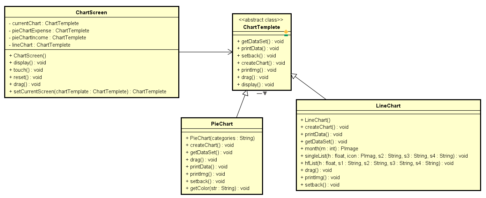
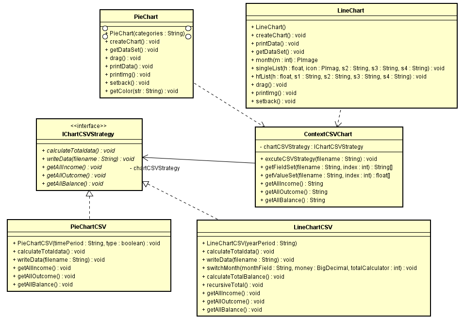

## Activity Diagram

## Use Case Overview Diagram

## Use Case Specification

### Document
https://github.com/nguyensjsu/sp19-202-rocket-202/blob/master/docs/UseCase.pdf

### Use Case - Login

### Use Case - Reset passcode

### Use Case - Change Screen

### Use Case - Add a new account

### Use Cae - View Statistic data and chart

### Use Case - Add Record

### Use Case - View Flows Use Drag

### Class Diagram State Design Pattern

### Class Diagram Command Pattern

### Class Diagram Observer Design Pattern

### Class Diagram Builder Design Pattern

### Class Diagram Template Design Pattern

### Class Diagram Strategy Design Pattern

