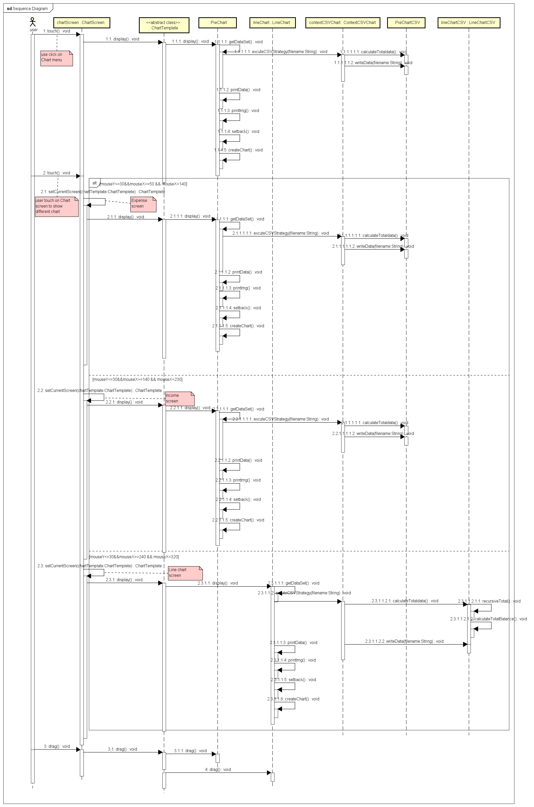

## Activity Diagram

## Use Case Overview Diagram

## Use Case - Login

## Use Case - Reset passcode

## Use Case - Change Screen

## Use Case - Add a new account

## Use Cae - View Statistic data and chart

## Use Case - Add Record

## Use Case - View Flows Use Drag

## Class Diagram State Design Pattern

## Class Diagram Command Pattern

## Class Diagram Observer Design Pattern

## Class Diagram Builder Design Pattern

## Class Diagram Template Design Pattern

## Class Diagram Strategy Design Pattern

